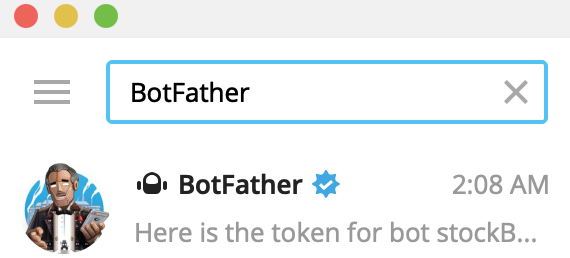
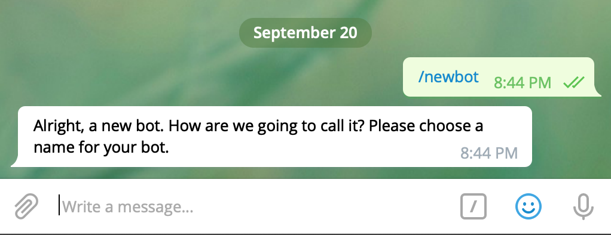
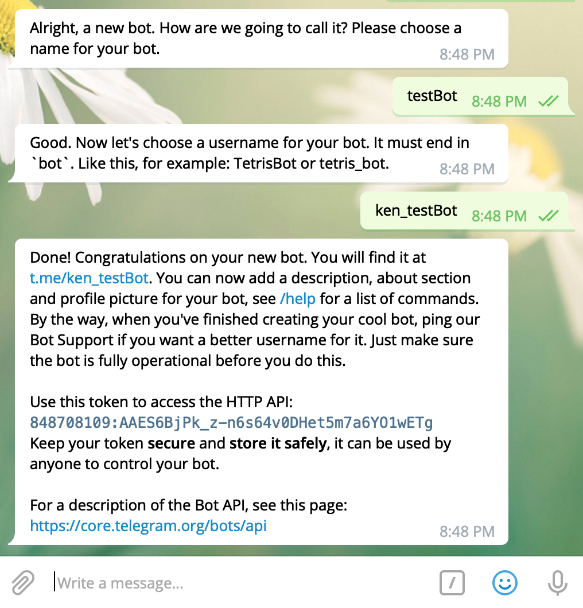
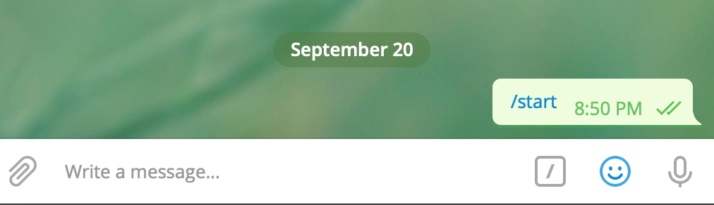

# Telegram Robot

## Search BotFather


## Create Robot
### Input the instruction
> /newbot



### Input the name of the robot
> bot-name

### Input the username of the robot
* The username is the unique id for the robot

> bot-username



## Start Robot
The name of the robot


### Get the Chat
* start the robot

> /start



* get the chat_id

```
import telegram

def main():
	token = "848708109:AAES6BjPk_z-n6s64v0DHet5m7a6YO1wETg"
	bot = telegram.Bot(token)
	chat_id = bot.get_updates()[-1].message.chat_id
```

* start coding

[Code Snippets](https://github.com/python-telegram-bot/python-telegram-bot/wiki/Code-snippets)

