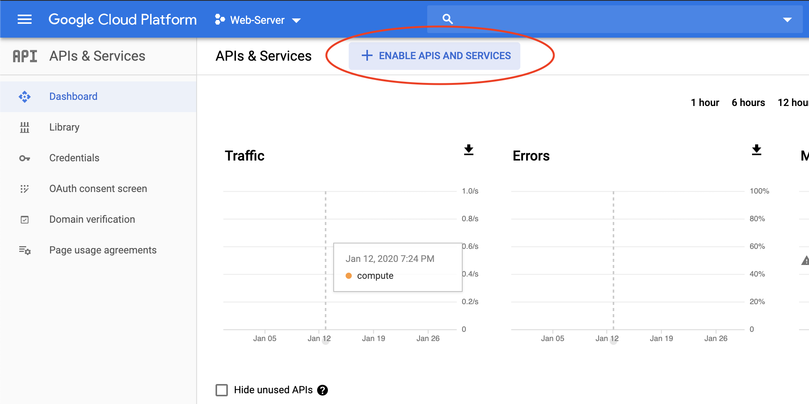
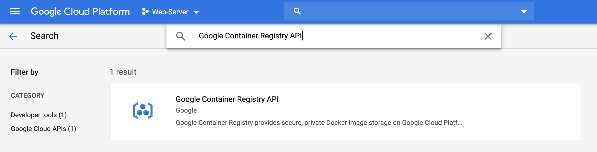
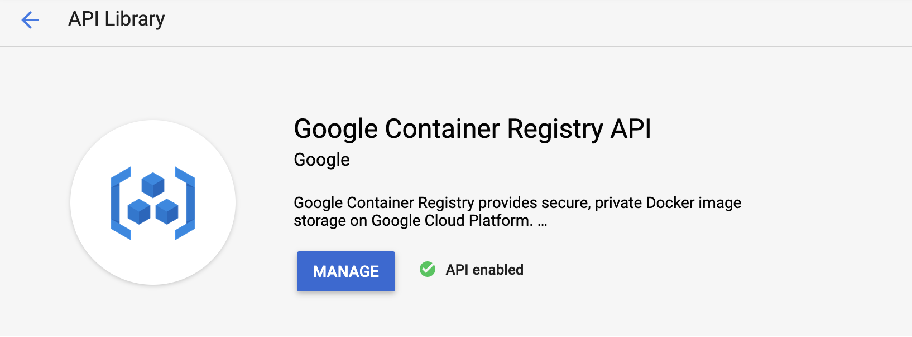

# Publish image to gcloud

[Reference](https://cloud.google.com/container-registry/docs/pushing-and-pulling)

### Tag source to target

[Reference](https://docs.docker.com/engine/reference/commandline/tag/)

```
> docker tag image_name gcr.io/project_id/gcloud_image_name

# Example
> docker tag go-web-server gcr.io/web-server-266606/go-web-server
```

### Adding credentials for all GCR repositories

[Reference](https://cloud.google.com/container-registry/docs/advanced-authentication)

```
> gcloud auth configure-docker
```

### Enable Google Container Registry API in Cloud Console

##### GCP -> APIs & Services -> Dashboard -> Enalbe APIs AND SERVICES


 
##### Search "Google Container Registry API"



##### Enabled



### Push image to gcloud

```
> docker push gcr.io/project_id/gcloud_image_name

# Example
> docker push gcr.io/web-server-266606/go-web-server
```